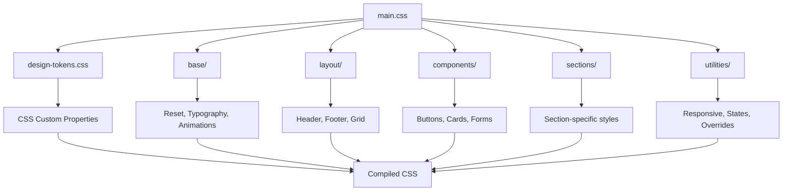
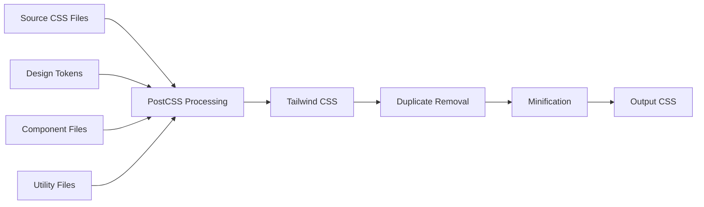

# Design Document

## Overview

This design establishes a clean, maintainable CSS architecture for the BloxMania theme by refactoring the current monolithic styles.css file into a modular, component-based system following Dawn theme patterns and modern CSS best practices. The architecture will eliminate duplications, resolve conflicts, and provide clear separation of concerns.

## Architecture

### CSS File Structure

The new architecture follows a layered approach with clear separation of concerns:

```
dev/css/
├── main.css                    # Main entry point (imports all files)
├── design-tokens.css           # CSS custom properties and design system
├── base/
│   ├── reset.css              # CSS reset and normalization
│   ├── typography.css         # Font definitions and text styles
│   ├── animations.css         # Keyframes and animation utilities
│   └── accessibility.css      # Focus states and screen reader styles
├── layout/
│   ├── header.css             # Header and navigation layout
│   ├── footer.css             # Footer layout
│   ├── grid.css               # Grid systems and containers
│   └── spacing.css            # Margin, padding utilities
├── components/
│   ├── component-button.css   # Button component styles
│   ├── component-card.css     # Card component styles
│   ├── component-mobile-menu.css # Mobile menu component
│   ├── component-product-form.css # Product form styles
│   ├── component-hero.css     # Hero section styles
│   └── component-*.css        # Additional components
├── sections/
│   ├── section-header.css     # Header section specific styles
│   ├── section-footer.css     # Footer section specific styles
│   ├── section-hero.css       # Hero section specific styles
│   └── section-*.css          # Additional section styles
└── utilities/
    ├── responsive.css         # Responsive utilities
    ├── states.css             # Hover, focus, active states
    └── overrides.css          # Necessary overrides and fixes
```

### Layer Architecture

The CSS follows Tailwind's layer system for proper cascade order:

1. **@layer base** - Reset, typography, base element styles
2. **@layer components** - Reusable component styles
3. **@layer utilities** - Utility classes and overrides

### Design Token System

Centralized design tokens using CSS custom properties:

```css
:root {
  /* Colors */
  --color-primary: #ffd800;
  --color-primary-50: #fffbeb;
  --color-primary-600: #d97706;
  --color-secondary: #4791f0;
  --color-background: #1d1e26;
  --color-surface: #252730;
  --color-foreground: #ffffff;
  --color-border: #333441;
  
  /* Spacing */
  --spacing-xs: 0.25rem;
  --spacing-sm: 0.5rem;
  --spacing-md: 1rem;
  --spacing-lg: 1.5rem;
  --spacing-xl: 2rem;
  --spacing-2xl: 3rem;
  
  /* Typography */
  --font-family-base: 'Inter', system-ui, sans-serif;
  --font-size-xs: 0.75rem;
  --font-size-sm: 0.875rem;
  --font-size-base: 1rem;
  --font-size-lg: 1.125rem;
  --font-size-xl: 1.25rem;
  
  /* Transitions */
  --duration-fast: 0.15s;
  --duration-default: 0.3s;
  --duration-slow: 0.5s;
  --easing-smooth: cubic-bezier(0.4, 0, 0.2, 1);
  --easing-spring: cubic-bezier(0.68, -0.55, 0.265, 1.55);
  
  /* Z-index scale */
  --z-dropdown: 1000;
  --z-sticky: 1020;
  --z-fixed: 1030;
  --z-modal-backdrop: 1040;
  --z-modal: 1050;
  --z-popover: 1060;
  --z-tooltip: 1070;
  --z-toast: 1080;
}
```

## Components and Interfaces

### Component Architecture

Each component follows a consistent pattern:

```css
/* component-button.css */
.btn {
  /* Base button styles using design tokens */
  display: inline-flex;
  align-items: center;
  gap: var(--spacing-sm);
  padding: var(--spacing-sm) var(--spacing-lg);
  font-family: var(--font-family-base);
  font-weight: 500;
  border-radius: 0.5rem;
  transition: all var(--duration-default) var(--easing-smooth);
  cursor: pointer;
  border: none;
  text-decoration: none;
}

.btn--primary {
  background-color: var(--color-primary);
  color: var(--color-background);
}

.btn--primary:hover {
  background-color: var(--color-primary-600);
  transform: translateY(-2px);
}

.btn--secondary {
  background-color: transparent;
  color: var(--color-primary);
  border: 1px solid var(--color-primary);
}
```

### Mobile Menu Component

The mobile menu component will be completely rewritten to eliminate conflicts:

```css
/* component-mobile-menu.css */
.mobile-menu {
  position: fixed;
  top: 0;
  left: 0;
  width: 100vw;
  height: 100vh;
  background: linear-gradient(135deg, rgba(0, 0, 0, 0.95) 0%, rgba(15, 23, 42, 0.95) 100%);
  backdrop-filter: blur(20px);
  z-index: var(--z-modal);
  display: flex;
  flex-direction: column;
  transform: translateX(-100%);
  transition: transform var(--duration-default) var(--easing-smooth);
}

.mobile-menu--open {
  transform: translateX(0);
}

/* Hide desktop navigation when mobile menu is open */
body:has(.mobile-menu--open) .header__navigation {
  display: none;
}
```

### Header Component

Simplified header with proper state management:

```css
/* layout-header.css */
.header {
  position: fixed;
  top: 0;
  left: 0;
  right: 0;
  z-index: var(--z-fixed);
  height: 120px;
  display: flex;
  align-items: center;
  transition: all var(--duration-default) var(--easing-smooth);
}

.header--scrolled {
  background: rgba(0, 0, 0, 0.4);
  backdrop-filter: blur(12px);
  box-shadow: 0 2px 12px rgba(0, 0, 0, 0.15);
}

.header--transparent {
  background: transparent;
}
```

## Data Models

### CSS Architecture Data Flow



### Build Process Data Flow



## Error Handling

### CSS Conflict Resolution

1. **Specificity Management**: Use consistent specificity levels across components
2. **Cascade Order**: Maintain proper import order in main.css
3. **Namespace Isolation**: Use component prefixes to prevent conflicts
4. **Override Strategy**: Limit overrides to utilities layer only

### Build Error Handling

1. **Duplicate Detection**: PostCSS plugin to detect and remove duplicates
2. **Syntax Validation**: Stylelint configuration for consistent code quality
3. **Import Validation**: Ensure all imported files exist and are valid
4. **Fallback Handling**: Provide fallbacks for CSS custom properties

### Mobile Menu Conflict Resolution

1. **Z-index Management**: Use centralized z-index scale
2. **State Management**: Clear open/closed state handling
3. **Body Scroll Lock**: Prevent background scrolling when menu is open
4. **Focus Management**: Proper focus trapping within mobile menu

## Testing Strategy

### CSS Architecture Testing

1. **Visual Regression Testing**: Compare before/after screenshots
2. **Component Isolation Testing**: Test each component in isolation
3. **Responsive Testing**: Verify layouts across all breakpoints
4. **Performance Testing**: Measure CSS file size and load times

### Mobile Menu Testing

1. **Functionality Testing**: Open/close behavior across devices
2. **Accessibility Testing**: Keyboard navigation and screen readers
3. **Conflict Testing**: Verify no conflicts with desktop navigation
4. **State Testing**: Test all possible menu states and transitions

### Build Process Testing

1. **Duplicate Detection**: Verify no duplicate rules in output
2. **Minification Testing**: Ensure minified CSS works correctly
3. **Source Map Testing**: Verify source maps for debugging
4. **Hot Reload Testing**: Test development build process

### Cross-browser Testing

1. **Modern Browsers**: Chrome, Firefox, Safari, Edge
2. **Mobile Browsers**: iOS Safari, Chrome Mobile, Samsung Internet
3. **CSS Feature Support**: Test CSS custom properties, backdrop-filter
4. **Fallback Testing**: Verify graceful degradation

### Performance Testing

1. **File Size Analysis**: Compare old vs new CSS file sizes
2. **Load Time Testing**: Measure CSS parsing and rendering times
3. **Critical CSS**: Identify and inline critical above-fold styles
4. **Unused CSS Detection**: Verify no unused styles in production

### Integration Testing

1. **Shopify Theme Testing**: Verify compatibility with Shopify platform
2. **Build System Integration**: Test with existing npm scripts
3. **Development Workflow**: Test hot reloading and file watching
4. **Production Deployment**: Test production build and deployment process